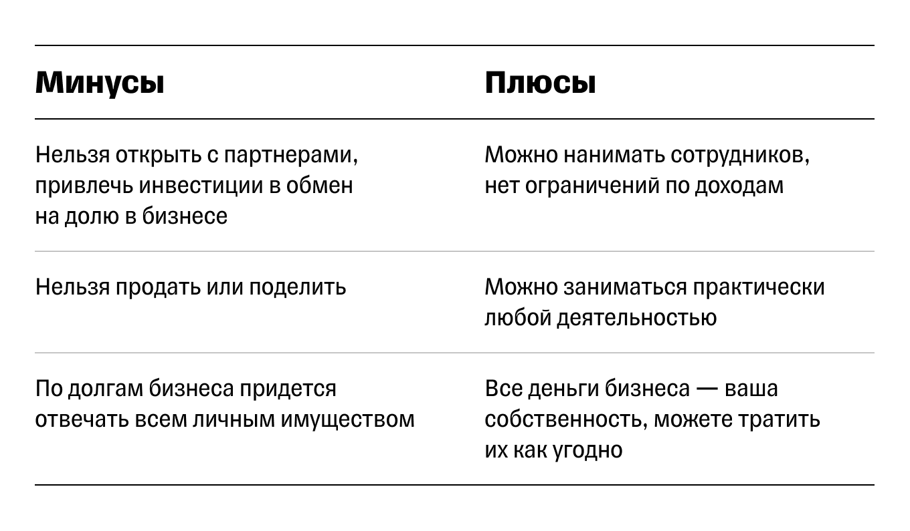
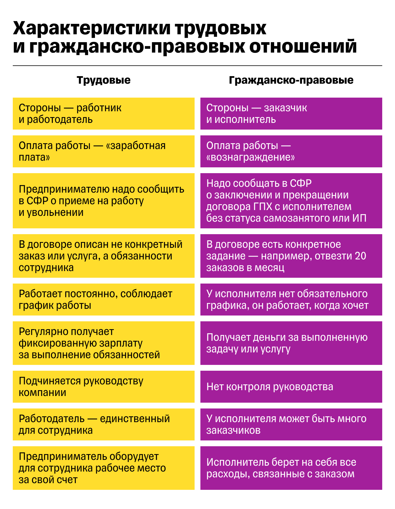

# Bigness_Form
_от Тинькоффа_
## **Самозанятый**
Легальный бизнес, минимум налогов.
- **Работает только один.**
- **Продает свои товары и услуги.** В налоговой нет какого-то специального списка разрешенной деятельности для самозанятости — можно заниматься чем угодно, если это не запрещено.

Нельзя перепродавать чужие товары и быть посредником.

    Нельзя заказывать одежду из Китая и перепродавать ее во ВКонтакте.

    Нельзя стать самозанятым риелтором и продавать квартиры.

## ИП
**Индивидуальный предприниматель** — статус человека.\
ИП работают наравне с компаниями: могут нанимать сотрудников, открывать новые точки, запускать продажи через приложение. Для работы придется открыть расчетный счет — счет для бизнеса. 

* **Все деньги на счетах — ваши деньги.**

* **Возможности как у компаний.** ИП, по сути, это обычная компания. Можно нанимать сотрудников, принимать платежи наличными и картами, работать с кем угодно и заниматься почти любой деятельностью.

**Из преимуществ** — налогов и отчетности меньше, чем у **ООО**, а еще намного ниже административные штрафы.

* **Нельзя продать или поделить.** ИП — ваш собственный статус (нельзя же продать себя), его нельзя зарегистрировать с партнером или привлечь инвесторов в обмен на долю в бизнесе. В качестве инвестиций вы можете только взять личный заем, но тогда вам придется его возвращать в любом случае — вне зависимости от того, удалось вам заработать на бизнесе или нет. 

* Все долги ИП — ваши личные.

ИП, в отличие от самозанятого, кроме налогов должен еще платить страховые взносы — минимум 45 842 ₽ в 2023 году. Их надо будет заплатить, даже если вообще не будет дохода. Единственное исключение — АУСН. ИП на этом режиме взносы не платит

ИП — удобный вариант для малого бизнеса.

## ООО
**Общество с ограниченной ответственностью** — для бизнеса с партнерами.\
**ООО** — это компания, которую могут открыть один или несколько человек. 

Есть несколько ситуаций, когда выгоднее открывать ООО:

    - вы начинаете бизнес с партнерами;
    - привлекаете инвестиции в обмен на долю в бизнесе и делаете большой проект;
    - занимаетесь деятельностью, которая не подходит для ИП или самозанятости.

* **Бизнес с партнерами.** Вы открываете компанию как бы в складчину: один приносит деньги, другой — уникальную технологию или идею, а третий дает помещение. Или просто все скидываются деньгами. В результате каждый владеет частью бизнеса.

_«Есть истории, когда друзья открывают бизнес вместе, но официально регистрируют ИП на кого-то одного, чтобы было проще. Но в этой ситуации все остальные юридически не имеют никаких прав на этот проект._

_Когда возникнет разногласия или кто-то захочет выйти из бизнеса, будет сложно договориться - можно потерять свои вложения или сильно поссориться. Лучше сразу регистрировать ООО и закрепить долю каждого участника юридически»._

* **Привлечение инвестиций и возможность продать компанию.**

* **Бизнес в определенных сферах деятельности.**

* **Много налогов и отчетности.** ООО обязано нанять как минимум одного сотрудника — директора. Поэтому у компании сразу возникает обязанность платить зарплату, НДФЛ, взносы вести бухучет и сдавать бухгалтерскую отчетность. А еще вести бухучет и раз в год сдавать бухгалтерскую отчетность.\
**Без бухгалтера в ООО не обойтись.**

* **Деньги компании не принадлежат учредителям напрямую**. В ООО деньги на расчетном счете и в кассе — собственность компании. Чтобы выдать их директору, надо начислить зарплату, а если учредителю — дивиденды, заплатить с них НДФЛ и официально все провести.

**Слышал, можно совмещать ИП и самозанятость, как это работает?**

    Да, это возможно.

    Для этого надо сначала зарегистрировать ИП, а потом выбрать НПД — налог для самозанятых — как систему налогообложения. Тогда вы сохраните статус ИП, но будете платить меньше налогов как самозанятый. Когда вы перейдете на НПД, начнут действовать все те же ограничения: нельзя будет нанимать сотрудников и иметь доход более 2,4 млн рублей в год.

    Это способ освободиться от уплаты фиксированных страховых взносов, который можно использовать, когда у бизнеса падает спрос и сильно уменьшается выручка.

## **Что такое ОКВЭД и зачем он нужен?**
Каждому виду деятельности Росстат присвоил код, который показывает, чем занимается компания или ИП. Коды перечислены в справочнике — [Общероссийском классификаторе видов экономической деятельности (ОКВЭД)](https://www.consultant.ru/document/cons_doc_LAW_163320/). 

ИП выбирает коды ОКВЭД и указывает их в заявлении. Можно выбрать сколько угодно кодов, но основным будет только один, а все остальные — дополнительными. Это важно, потому что благодаря основному коду ОКВЭД предприниматели получают налоговые и другие вычеты и льготы от государства, например налоговые каникулы для вновь зарегистрированных ИП или пониженные налоговые ставки

Коды ОКВЭД не формальность, а помощник для бизнеса. Например, по ним государство устанавливает льготы для определенных отраслей. Для ИТ-компаний до конца 2024 года — нулевой налог на прибыль. Льготы распространяются на группы ОКВЭД, которые определяют по первым двум цифрам кода.

По кодам ОКВЭД государство видит, чем занимается бизнес. В некоторых сферах бизнеса нужно проходить дополнительные проверки, покупать лицензии. На коды ОКВЭД обращают внимание еще и банки.

Если у банка возникнут сомнения в легальности платежей, он обязан заблокировать операцию.

Нужно выбрать коды ОКВЭД тех видов деятельности, которыми вы действительно будете заниматься. Пишете тексты, преподаете английский, а еще продаете одежду — выбирайте коды под каждую деятельность. Так вы снимете лишние вопросы налоговой и банка. Об этом еще расскажем чуть позже.

# **Как выбрать код ОКВЭД**
тобы выбрать подходящие коды ОКВЭД, нужно ответить на вопросы: «Что делаем? Где? Для кого?» Например: 

    1. Что делаем? → Готовим, пакуем и доставляем еду
    2. Где? → В арендованном цеху.
    3. Для кого? → Для розничного потребителя. 

Важно учитывать детали. Влияет, что вы продаете, где и каким способом. У торговли оптом и в розницу будут разные коды. 

# **Выбрать основной и дополнительные виды деятельности**
**Основным кодом** - Основная деятельность приносит больше всего доходов.\
**Дополнительные коды** — все остальные виды деятельности, которые могут приносить бизнесу доход. Лучше указать несколько кодов про запас.

Проверьте перед регистрацией, есть ли льготы в вашей области. Если есть, возможно, стоит выбрать основным тот код ОКВЭД, который под них подпадает.

По дополнительным кодам льготы не назначаются, но они уточняют для налоговой источники дохода. 

В целом это все, что вам нужно знать о кодах ОКВЭД, чтобы верно заполнить заявление на регистрацию ИП.

**Сколько кодов можно указать?**

    По закону нет ограничений на количество кодов. Но если их окажется много и они будут разнородные, налоговая или банк могут заподозрить, что это фирма-однодневка.
    
    Юристы рекомендуют указывать не больше 20 кодов. Обычно ИП используют 5—7 кодов в смежных видах деятельности. Например, редактор может одновременно вести рекламу, рисовать несложные баннеры и консультировать. 

**Что будет, если работать по кодам, которые не указал?**

    Коды используются, чтобы уменьшить число компаний-однодневок. Они не ведут реальную деятельность, а нужны для того, чтобы помогать другим компаниям уходить от уплаты налогов и отмывать деньги. Все это, конечно, незаконно. Задача отслеживать такие компании лежит на налоговой, бухгалтерах, банках, юристах, адвокатах, страховых и самих предпринимателях.

    Если работаете по кодам, которые не указали при регистрации, у вас могут быть проблемы с контрагентами или налоговая устроит проверку.

    Проверка налоговой. Если в кодах ОКВЭД указано одно, а компания занимается чем-то другим или виды деятельности часто меняются, налоговая может устроить проверку.

    Проблемы с контрагентами. Перед заключением крупных договоров контрагенты могут проверить ваши коды ОКВЭД. Это нужно, чтобы понять, настоящий ли это ИП или фирма-однодневка. Если коды не совпадут, партнер может отказаться от крупной сделки.

    Вопросы от банка. По закону 115-ФЗ банк может приостановить операцию и запросить документы для проверки сделки и контрагента, если коды в договоре отличаются от кодов ИП. 

    Чтобы себя обезопасить, лучше указать правильные коды и менять их при необходимости.

**Что делать, если ни один код не подходит под вид деятельности?**

    Выбрать несколько смежных и указать любой из них в качестве основного.

### Главное
* Коды ОКВЭД нужны, чтобы государство понимало, чем занимается бизнес. Все коды ОКВЭД можно найти в справочнике.

* Перед регистрацией надо выбрать один основной код ОКВЭД и несколько дополнительных. Обычно предприниматели выбирают 5—7 кодов.

* По основному коду ОКВЭД государство решает, давать льготы бизнесу или нет, поэтому перед регистрацией проверьте, есть ли льготы в вашей сфере.

* Нужно выбрать те коды видов деятельности, по которым вы действительно будете работать. Иначе вам грозят вопросы от налоговой и банка. 

## Что ИП платит государству
* Какие есть системы налогообложения.
* Как выбрать выгодную для себя.

### Страховые взносы — на пенсионное и медицинское страхование

Страховые взносы есть на всех режимах налогообложения, кроме НПД и АУСН. 

Они делятся на **фиксированные** и **дополнительные**. «Фиксированные» значит, что предприниматель знает, сколько должен заплатить в текущем году. Сумма внезапно не увеличится. В 2023 году это `45 842 ₽`. 

Взносы платят в налоговую, а она сама распределяет деньги в социальный фонд и фонд ОМС. Размер взносов немного меняется год от года, точную сумму можно посмотреть в [налоговом кодексе](https://www.consultant.ru/document/cons_doc_LAW_28165/c03008a92ccba28226abe4034e9aa43e3a2ffeb4/). 

Дополнительные взносы зависят от дохода предпринимателя, это 1% от доходов свыше 300 000 ₽. Их тоже платят в налоговую, но по факту они идут в Социальный фонд. 

    Даня за 2023 год планирует заработать 2 500 000 ₽. 

    Фиксированные страховые взносы в 2023 году — 45 842 ₽.

    Доход превысил 300 000 ₽, поэтому Даня должен заплатить еще 1% от доходов. 
    Переменная часть считается так: (2 500 000 ₽ − 300 000 ₽) × 1% = 22 000 ₽.

    Итого: 45 842 ₽ + 22 000 ₽ = 67 842 ₽.
Для дополнительных взносов есть верхний лимит.\
В 2023 году — `257 061 ₽`. Если рассчитанная сумма взносов окажется выше, платить сверх лимита ничего не надо.\
У страховых взносов есть приятный бонус: на них можно уменьшить налог.

Если ИП выберет в качестве налогового режима самозанятость или АУСН, ему можно вообще не платить страховые взносы. При этом он сохранит статус ИП, но будет обязан соблюдать все условия выбранного налогового режима

### Налоги: пять систем налогообложения
Всего в России пять систем налогообложения (СНО) — одна основная и четыре специальных:

    1. Общая система налогообложения (ОСНО) — она как раз и считается основной. 
    2. Единый сельскохозяйственный налог (ЕСХН).
    3. Упрощенная система налогообложения (УСН).
    4. Патентная система налогообложения (ПСН), или патент.
    5. Налог на профессиональный доход (НПД), или самозанятость.

Основная система присваивается бизнесу по умолчанию. Грубо говоря, если вы пойдете в налоговую, подадите заявление на регистрацию ИП и не будете сами выбирать режим, то через 30 календарных дней у вас будет ИП на общей системе налогообложения.

Если вы не хотите работать на ОСНО, надо вместе с регистрацией подать уведомление о переходе на специальный режим. Иначе после регистрации у вас будет только 30 дней, чтобы поменять режим налогообложения. После этого срока поменять режим можно будет только в следующем году.

Специальные режимы созданы под конкретные виды компаний или их потребности. Например, на патенте могут работать только ИП, а на едином сельскохозяйственном налоге — фермерские и крестьянские хозяйства. Специальные режимы — забота государства о малом бизнесе. 

####  Общая система налогообложения (ОСНО)
**ОСНО, или общая система, подходит большому бизнесу:**

    - если оборот более 251,4 млн рублей в год; 
    - работает больше 130 сотрудников; 
    - среди партнеров в основном другие крупные компании.

А малому на общей системе работать неудобно: приходится платить слишком много налогов. Для таких компаний и ИП есть спецрежимы. 

На общей системе ИП платит много налогов. Посмотрите сами: НДФЛ 13%, НДС 20% и налог на имущество.

#### Единый сельскохозяйственный налог (ЕСХН)
Это льготная система, на которой могут работать только сельхозпроизводители, которые производят что-то из своего сырья.

На ЕСХН не нужно платить налог на прибыль и НДФЛ, а также налог на имущество с недвижимости для сельхозпроизводства. Ставку налога каждый регион устанавливает самостоятельно, но не более 6% прибыли. НДС на ЕСХН платят, но есть льготы.

#### Упрощенная система налогообложения (УСН)
На упрощенке предприниматель платит государству процент от дохода или прибыли. Если дохода нет, платить налог не надо. 

Компании и ИП на УСН обязаны раз в год подавать декларацию в налоговую. Если доходов не было, подают нулевую декларацию.

**Ограничения для бизнеса на УСН:**

    - доход не более 251,4 млн рублей в год;

    - не больше 130 человек в штате;

    - нельзя производить подакцизные товары, кроме сахаросодержащих напитков, быть банком, ломбардом или микрофинансовой организацией;

    - остаточная стоимость основных средств — до 150 млн рублей включительно. Основные средства — это имущество первоначальной стоимостью более 100 000 ₽ и сроком полезного использования более 12 месяцев, например производственное оборудование и офис. Их остаточная стоимость — это первоначальная стоимость минус амортизация.

В этой системе два подвида: **УСН «Доходы»** и **УСН «Доходы минус расходы»**. Опять же, они созданы для удобства разного бизнеса. Различаются способом начисления налогов и ставкой. 

**УСН «Доходы».** Налог начисляется на все доходы предпринимателя. Подходит, если расходы на бизнес небольшие или их и вовсе нет. Например, копирайтер или дизайнер получает гонорар за работу, а расходов у него никаких — может только курьера отправить с документами раз в месяц. Тогда подходит УСН «Доходы». 

Ставка — 6% годовых, регионы могут ее уменьшать.

    Если Аня за год заработает 2 500 000 ₽ во Владивостоке, где налоговая ставка 6%, она должна будет заплатить 2 500 000 ₽ × 6% = 150 000 ₽.

    Если Аня зарегистрирует бизнес на Камчатке, то заплатит меньше. Ставка по УСН «Доходы» в Камчатском крае — 3%, поэтому Аня заплатит меньше налогов: 2 500 000 ₽ × 3% = 75 000 ₽.

Доходом считаются все деньги, которые заплатили клиенты ИП. Нужно считать именно сумму в чеке клиенту, даже если часть этих денег сразу ушла банку как комиссия за безналичную оплату или посредникам при продаже. 

Если обороты вырастут, платить придется больше: в 2023 году доход от 188,5 млн до 251,4 млн рублей облагается по ставке 8%, региональные льготы не действуют. Если доход превысит верхний лимит, придется перейти на ОСНО.

**УСН «Доходы минус расходы».** Налог нужно платить с прибыли. Подходит, если расходов больше 60% от оборота. Например, ресторанам с большим количеством персонала и дорогими продуктами, производствам с дорогим сырьем.

Ставка — 15%, регионы могут снижать ее по своему усмотрению.

Ставка зависит от дохода. Если предприниматель заработает от 188,55 млн до 251,4 млн рублей, ставка повысится до 20%. При доходе свыше 251,4 млн рублей придется перейти на общую систему налогообложения.

    Если Аня заработает 2 500 000 ₽ во Владивостоке и потратит на расходы для бизнеса 1 000 000 ₽, она должна будет заплатить: (2 500 000 ₽ − 1 000 000 ₽) × 15% = 225 000 ₽. 

На УСН «Доходы минус расходы» есть минимальный налог: 1% при доходе до 188,5 млн рублей, 3% при доходе от 188,5 млн до 251,4 млн рублей. Его платят, если рассчитанный налог получился меньше 1% дохода предпринимателя. 

Нельзя записать в расходы любые покупки. Затраты должны относиться к бизнесу и входить в [специальный список](https://www.consultant.ru/document/cons_doc_LAW_28165/2428f19fbea7040de2388dd179c39e787cc0d07d/), утвержденный налоговым кодексом.

#### Автоматическая упрощенная система налогообложения (АУСН)
Основной принцип расчета налогов на АУСН такой же, как на обычной упрощенке — «Доходы» или «Доходы минус расходы». 

Ставки налога на АУСН выше, чем на УСН, но требований к отчетности меньше. Кроме того, предприниматели и компании на этом режиме не платят страховые взносы, не сдают декларацию и часть отчетов за сотрудников.

**Ограничения для бизнеса на АУСН:**

    - до пяти наемных работников;

    - до 60 млн рублей дохода в год;

    - расчетный счет можно открыть только в банке из перечня ФНС. 

[Перечень ФНС](https://ausn.nalog.gov.ru/#block07ancor)

Ставка налога на АУСН **«Доходы» — 8%**, **«Доходы минус расходы» — 20%**. В отличие от УСН, региональных льгот нет. 

На АУСН налоговая сама считает налог к уплате. Нужные данные берет из личного кабинета налогоплательщика, операций по онлайн-кассе и из банка, где открыт расчетный счет.

Предприниматели на АУСН не платят страховые взносы, не сдают декларацию и часть отчетов за сотрудников.

Ане АУСН не подходит, так как она открывает бизнес во Владивостоке, а там этот режим сейчас не действует.

#### Патентная система налогообложения (ПСН), или патент

Патент работает как подписка: заплатил вперед деньги — и работаешь. Можно выбрать срок патента — от месяца до года. 

Его покупают на конкретный вид деятельности: например, услуги фотографа. Купил патент один раз — и как бы оформил подписку на год: больше никаких налогов с дохода не платишь. 

Правда, есть нюанс — патент можно купить только дополнительно к базовой системе налогообложения: основной (ОСН) или упрощенной (УСН).

_Патент — как бы дополнение к изначальной системе налогообложения, его нельзя купить отдельно. Он закрывает вопрос с налогами по конкретному виду деятельности. Например, если бы Аня купила патент на работу кафе, то по нему она могла бы заниматься только этим — на доставку он бы не распространялся._

_И вот здесь кроется подводный камень патента: у предпринимателя могут появиться доходы, которые под патент не подходят. Например, приходит кэшбэк от банка. И все, этот доход сразу облагается налогом по изначальной системе._

_Если Аня купит патент на ОСН, за кэшбэк ей придется заплатить по всем правилам ОСН и сдать кучу отчетности_

Если вы хотите работать на патенте, лучше сначала перейти на УСН, а потом купить патент. 

**Ограничения для бизнеса на патенте:**

    только для ИП;

    доход до 60 млн рублей в год по всем патентам, если у ИП их несколько;

    в штате максимум 15 сотрудников, не считая тех, кто ушел в декрет;

    виды деятельности из списка, который устанавливают регионы РФ.

[Список](https://www.nalog.gov.ru/rn77/taxation/taxes/patent/)

Стоимость патента зависит от региона. Рассчитать точный размер патента можно [на сайте налоговой службы](https://patent.nalog.ru/info/).

Если дело не пойдет, деньги за патент можно вернуть, но только за неотработанные дни. Например, если вы купили патент на год и через месяц подали заявление об отказе, налоговая вернет деньги за оставшиеся 11 месяцев.

#### Налог на профессиональный доход (НПД), или самозанятость
Налог на профессиональный доход (НПД) платят самозанятые, но ИП тоже может перейти на эту систему.

На этом режиме, если заработка нет, не надо подавать декларацию и отчитываться перед налоговой. Страховые взносы платить не надо в любом случае, неважно, есть заработок или нет.

**Ограничения для бизнеса на НПД:**

    - нельзя нанимать сотрудников по трудовым договорам;

    - перепродавать товары, например с AliExpress;

    - работать по агентским договорам, например продавать турпутевки от разных туроператоров;

    - производить подакцизные товары, например шубы или алкоголь;

    - получать доход больше 2,4 млн рублей в год.

Ставка зависит от того, кто ваши покупатели:

    4%, если физлица без статуса ИП;
    6%, если юрлица и ИП.

Еще для всех новичков на режиме НПД действует налоговый вычет — `10 000 ₽`. Первое время налоговая будет уменьшать налог на часть вычета.

    Если Аня за год заработает 2 400 000 ₽, при расчете НПД будет иметь значение, кто оплачивал работу. 

    Допустим, 1 400 000 ₽ Ане заплатили обычные люди за домашние обеды, а 1 000 000 ₽ — компании за кейтеринг.

    Тогда Аня должна будет заплатить: (1 400 000 ₽ × 4%) + (1 000 000 ₽ × 6%) = 116 000 ₽.

    А еще она сможет в первый год получить налоговый вычет: 116 000 ₽ − 10 000 ₽ = 106 000 ₽.

Если дело не пойдет, можно будет вообще ничего не платить.

### Что выбрать: НПД, УСН или патент?

Если предпринимателю подходят сразу четыре системы налогообложения, он должен сесть и посчитать приблизительные суммы доходов и расходов и выбрать самую выгодную.

    Аня будет готовить домашние обеды в арендованном цеху и доставлять их клиентам домой и в офисы. Еще Аня планирует заниматься кейтерингом и кормить людей на вечеринках. 

    В среднем Аня планирует зарабатывать 2 500 000 ₽ в год и тратить до 1 000 000 ₽ на расходы: закупать еду, платить за аренду и оплачивать услуги курьеров. 

    Посчитаем, сколько денег Аня должна заплатить государству на разных режимах. Предполагаем, что Аня работает одна, без сотрудников.

**УСН «Доходы минус расходы».**

На УСН «Доходы минус расходы» дополнительные страховые взносы считаются по такой формуле: 

    Рассчитаем страховые взносы для Ани: 45 842 ₽ + (2 500 000 ₽ − 1 000 000 ₽ − 300 000 ₽) × 1% = 45 842 ₽ + 12 000 ₽ = 57 842 ₽.

    Потом налог: (2 500 000 ₽ − 1 000 000 ₽ − 57 872 ₽) × 15% = 216 319 ₽.

    Всего Аня заплатит государству налог и страховые взносы: 216 319 ₽ + 57 842 ₽ = 274 161 ₽

**АУСН «Доходы минус расходы».** 

Принцип расчета налога тот же, что и на обычной УСН, отличается ставка.

    (2 500 000 ₽ − 1 000 000 ₽) × 20% = 300 000 ₽.

Страховые взносы на АУСН платить не надо.

**УСН «Доходы».**

Здесь тоже надо заплатить фиксированные и дополнительные страховые взносы и налог.

На УСН «Доходы» дополнительные взносы считаются по-другому:

Посчитаем дополнительные страховые взносы для Ани на УСН «Доходы»:

    (2 500 000 Р − 300 000 ₽) × 1% = 22 000 ₽.

    Итого Ане надо заплатить страховых взносов: 45 842 ₽ + 22 000 ₽ = 67 842 ₽.

    Потом Аня заплатит налог, из которого можно вычесть страховые взносы, которые уже перечислили: (2 500 000 ₽ × 6%) − 67 842 ₽ = 82 158 ₽.

    Всего Аня заплатит государству налог плюс страховые взносы: 82 158 ₽ + 67 842 ₽ = 150 000 ₽.

**АУСН «Доходы».** 

Платеж рассчитывается аналогично, но по ставке 8%.

    2 500 000 ₽ × 8% = 200 000 ₽.

Страховые взносы платить не нужно. За счет этого сумма к уплате на УСН и АУСН получается одинаковая, несмотря на более высокую ставку налога. Если Аня заработает меньше 2 500 000 ₽, АУСН будет для нее выгоднее, чем обычная УСН.

Впрочем, АУСН пока не действует во Владивостоке — Аня ее выбрать не сможет.

**НПД.**

В нашем примере Аня не может оставаться на НПД, потому что ее доходы превышают допустимую при этом режиме сумму

Но если бы Аня зарабатывала меньше 2 400 000 ₽, то она могла бы выбрать НПД.

Расчет подходит для дохода 2 400 000 ₽, из которых 1 400 000 ₽ Ане заплатили люди без статуса ИП, а 1 000 000 ₽ — компании и ИП.

Страховые взносы на НПД платить не надо.

    (1 400 000 ₽ × 4%) + (1 000 000 ₽ × 6%) = 116 000 ₽.

    А еще в первый год действует налоговый вычет: 116 000 ₽ − 10 000 ₽ = 106 000 ₽.

**Патент.**

Патент на сервис по доставке еды в 2023 году во Владивостоке стоит 52 649 ₽. Ограничение по количеству наемных сотрудников — 15 человек — Аню устраивает. Страховые взносы она может вычесть из стоимости патента. 

    Стоимость патента после вычета: 52 649 ₽ − 45 842 ₽ = 6807 ₽.

К этой сумме нужно добавить дополнительные взносы. Их рассчитывают по формуле:
 

    Получается: ((52 649 ₽ / 0,06) − 300 000 ₽) × 1% = (877 483 ₽ − 300 000 ₽) × 1% = 5775 ₽.

    Всего Аня заплатит государству за первый год работы: 6807 + 5775 = 12 582 ₽.

Если у вас есть возможность применять патент и НПД — выбирайте эти налоговые режимы. Скорее всего, они будут самыми выгодными для вашего бизнеса. Для тех, кто впервые регистрирует ИП на патенте или на упрощенке, до конца 2024 года в некоторых отраслях [действуют налоговые каникулы](https://normativ.kontur.ru/document?moduleId=1&documentId=367407&utm_source=google&utm_medium=organic&utm_referer=www.google.com&utm_startpage=kontur.ru%2Farticles%2F3080&utm_orderpage=kontur.ru%2Farticles%2F3080) — ставка равна нулю.

По расчету Ане выгоднее всего работать на патенте — за год она заплатит государству 12 582 ₽.

### Как перейти на спецрежим при регистрации
Если вы просто подадите заявление о регистрации ИП в налоговую, вам автоматически присвоят режим ОСНО.

Чтобы этого не произошло, надо подать уведомление о переходе на спецрежим. Это можно сделать одновременно с регистрацией или в течение 30 дней после открытия ИП. Когда 30 дней истекут, перейти на другой режим можно будет только в начале следующего года. Исключение составляет патент — на него можно перейти в любое время.

Если вы пока не решили, рекомендуем сразу подать уведомление о переходе на УСН и потом, если понадобится, перейти на другой режим в любое время.

В Тинькофф мы подаем уведомление о переходе на УСН за вас вместе с регистрацией. Если вы хотите сразу перейти на патент, поможем с оформлением документов в течение месяца после регистрации.

**Что будет, если не платить налоги?**

Если не уложиться в сроки, налоговая начислит пени по формуле:

Если ИП в июне 2023 года задержал 100 000 ₽ налога на 9 дней, он должен заплатить:

    100 000 ₽ × 1/300 × 7,5% × 9 = 225 ₽.

При этих условиях каждый день просрочки стоит 25 ₽. 

Кроме пени за нарушения налоговая назначает штрафы: 

    1. За задержку подачи декларации — 5% от суммы не уплаченного в срок налога за каждый полный и неполный месяц просрочки, но не более 30% указанной суммы и не менее 1000 ₽.

    2. За неуплату налога в результате неверного расчета — 20%, за умышленную неуплату — 40%. Умышленная неуплата — дробление бизнеса, чтобы сохранить спецрежимы и не переходить на ОСНО, или фиктивные сделки для увеличения стоимости товара, которую включают в налоговые расходы. 

Если задержать уплату налогов и штрафов на два месяца и больше, налоговая может выставить инкассовое поручение. Исполнить инкассовое поручение должен банк: он списывает все деньги со счетов должника и переводит на счет налоговой. Если списывать нечего, дело передают приставам.

**Что будет, если дело не пойдет и дохода не будет?**

**На НПД не будет ничего**: страховые взносы и минимальную ставку платить не нужно, подавать декларацию и другую отчетность — тоже.

**На УСН «Доходы»** нужно будет подать нулевую декларацию и заплатить фиксированные страховые взносы. Налог с дохода платить не надо.

**На УСН «Доходы минус расходы»** не платить налог можно, только если вообще не было заработка. Даже при убытке нужно заплатить страховые взносы и минимальный налог — 1% от дохода. 

**На патенте** вы можете подать в налоговую отказ от ведения деятельности. Тогда вам пересчитают стоимость патента на количество отработанных дней и вернут разницу. После этого купить еще раз такой патент в текущем году уже будет нельзя. 

Заявление надо подать в течение 10 дней после прекращения деятельности. Если после отказа от патента вы перейдете на другой налоговый режим и не закроете ИП, то до конца года все еще надо будет заплатить страховые взносы.

### Главное

1. ИП больше всего подходят специальные режимы: 

    НПД — предпринимателям, которые работают без сотрудников и зарабатывают до 200 000 ₽ в месяц;

    УСН «Доходы» — тем, у кого расходы на бизнес небольшие или их нет совсем, а также тем, кто зарабатывает больше 200 000 ₽ или планирует нанимать сотрудников;

    УСН «Доходы минус расходы» — тем, у кого расходы превышают 60% доходов: например, если есть сотрудники и закупки;

    АУСН — тем, кто открывает бизнес в Москве, Московской и Калужской областях или Республике Татарстан и при прочих равных выбрал бы УСН;

    патент — тем, для кого стоимость патента ниже, чем налог на УСН при таких же доходах. 

2. Подайте уведомление о переходе на УСН сразу вместе с регистрацией ИП или в течение 30 дней после.

## Какие есть варианты регистрации ИП
ИП регистрируют в налоговой по месту прописки. Из документов нужны:

* паспорт;
* заполненная [форма Р21001](https://www.nalog.gov.ru/rn77/related_activities/registration_ip_yl/registration_ip/order/4162994/);
* квитанция об уплате госпошлины;
* уведомление о переходе, если вы выбрали УСН. 

Зарегистрировать ИП по месту временной прописки можно, только если нет постоянной.

* **Лично в МФЦ.** Нужно самостоятельно заполнить и принести форму Р21001. МФЦ передаст бумаги в налоговую.

* **Онлайн в налоговой.** У налоговой службы есть [электронный сервис](https://service.nalog.ru/gosreg/?t=1603987441228#ip). Этот способ — самый быстрый, если вы [уже оформили](https://www.nalog.gov.ru/rn77/goskey/) квалифицированную электронную подпись.

* **Через нотариуса.** Он заполняет пакет документов и передает их в налоговую дистанционно с помощью личной электронной подписи.

* **Через банк или сервисы регистрации.** Банк и сервисы по регистрации работают по такому же принципу, что и нотариус: помогают заполнить документы и передать их в налоговую.

[При регистрации через Тинькофф](https://www.tinkoff.ru/business/registration/help-ip/) нужны только паспорт и СНИЛС. Паспорт — для налоговой, СНИЛС — для самого банка. На процедуру регистрации будущий ИП потратит 15 минут, остальное сделает банк.

    - заполнить короткую анкету на сайте;
    - приложить копию паспорта;
    - назначить встречу с представителем и подписать документы.

Через три дня налоговая прислалает на почту подтверждение регистрации — выписку из ЕГРИП.

### Что делать сразу после регистрации

Перед началом работы надо открыть расчетный счет и предупредить надзорные органы.

**Открыть расчетный счет.** Он нужен для расчетов с контрагентами и покупателями — на него будут приходить деньги, с него вы будете платить налоги и оплачивать расходы бизнеса.

Принимать деньги на обычный счет в банке или личную карту по закону нельзя.

ИП может работать без расчетного счета и рассчитываться с компаниями и другими ИП наличными, если объем платежей по одному договору не превышает 100 000 ₽

Подробно про расчеты наличными — [в указании Банка России от 09.12.2019 № 5348-У.](https://www.consultant.ru/document/cons_doc_LAW_350539/)

Если вы подаете заявление через банк, он откроет вам расчетный счет одновременно с регистрацией — ничего дополнительно заполнять и платить не надо.

Роспотребнадзор и другие ведомства надо уведомить, если ваш бизнес есть в [этом списке](https://www.consultant.ru/document/cons_doc_LAW_89755/68f66d5e794767b6c72c360f517ed50be3bc0ba9/). Лицензия потребуется, чтобы вести деятельность из перечня, который зафиксирован [в законе № 99-ФЗ](https://www.consultant.ru/document/Cons_doc_LAW_113658/6a4a5b5468ba8b99831699f7d048d2a5d7710610/).

Аня будет готовить еду и выбрала основной код ОКВЭД 56.10 «Деятельность ресторанов и услуги по доставке продуктов питания». Это относится к предоставлению услуг общественного питания, поэтому нужно уведомить Роспотребнадзор о начале деятельности. Лицензия на нее не нужна.

**Нужен ли ИП юридический адрес?**

Нет. Адресом ИП признают адрес его постоянной регистрации. Если ее нет, то адрес временной регистрации. При этом ИП не обязан быть собственником помещения, достаточно отметки о регистрации. 

**Нужна ли ИП печать?**

По закону ИП не обязан иметь печать, однако вы можете ее изготовить. В глазах контрагентов, которые привыкли работать с печатями, вы будете выглядеть солиднее.

Хотя формальных требований к содержанию печати ИП нет, принято на ней указывать:
* ФИО;
* указание на статус ИП;
* регион постановки на учет;
* ИНН;
* ОГРНИП.

Регистрировать печать не нужно. 

**Как зарегистрировать ИП без прописки?**

Если у вас нет постоянной регистрации, нужно предъявить паспорт без соответствующего штампа, а также свидетельство о временной регистрации. Она должна действовать еще минимум шесть месяцев с даты подачи документов для регистрации ИП.

### Главное

    1. Для регистрации нужны паспорт и заявление по форме Р21001. Вы можете заполнить заявление самостоятельно или через посредника: нотариуса или банк.

    2. Зарегистрировать ИП нужно по месту постоянной регистрации, а если ее нет, то по месту пребывания. Отдельный юридический адрес не нужен.

    3. Если у вас есть усиленная квалифицированная электронная подпись или приложение «Госключ», то зарегистрироваться можно из любой точки мира. Если подписи нет, поможет нотариус или банк. 

    4. Самый быстрый и дешевый способ регистрации ИП — через банк. Не надо платить пошлину и заполнять форму. Достаточно загрузить копию паспорта и заполнить короткую анкету — все остальное банк возьмет на себя.

    5. Налоговая регистрирует ИП за три дня. После этого надо открыть расчетный счет, при необходимости — уведомить госорганы, и можно начинать работу.

## На что обращать внимание при выборе банка

* **Счета на оплату.**
* **Лимиты на снятие денег.**\
Иногда бывает так: тариф дешевый, но потом всплывает большая комиссия за вывод денег на личную карту. Каждый раз, когда вы будете снимать собственные деньги со счета, придется часть отдавать банку. Например, выводите 100 000 ₽, а сверху еще 1000 ₽ отдаете комиссией. 
* **Бизнес-карта.** Карта привязана к счету ИП. Грубо говоря, пришли деньги на счет, и сразу же они видны на карте и можно их тратить.\
Бизнес-карта — идеальный вариант, чтобы расплачиваться и за покупки для бизнеса, и за свои. А остальные деньги можно переводить на личную карту и с нее уже снимать наличку, если понадобится.
* **Мобильное приложение.**
* **Бухгалтерия.** Удобно, когда в банке есть онлайн-бухгалтерия и бухгалтерское обслуживание: тогда можно все делать через банк и не искать отдельного бухгалтера на аутсорсе. Онлайн-бухгалтерией можно пользоваться, если у вас ИП на УСН «Доходы» и нет сотрудников, — приложение подготовит документы для налоговой и все посчитает само, надо будет только нажать на кнопку «Оплатить».

А если выбрать бухгалтерское обслуживание, то вашими налогами будет заниматься живой бухгалтер: он будет вести учет и выполнять ваши поручения. В Тинькофф с ним можно будет посоветоваться как с личным бизнес-консультантом.

### Как посчитать, что выгоднее

На рекламных лендингах банки пишут только плюсы и не говорят про ограничения или высокие комиссии. Поэтому перед выбором важно скачать полную версию тарифов и внимательно прочитать условия. Ссылку на файл обычно можно найти внизу раздела с тарифами.

Из этого файла выпишите стоимость сервисов, которыми вы планируете пользоваться, и ограничения, которые есть на тарифе

**Можно ли снимать со счета наличку?**

В целом, да. Деньги на счете ИП — это ваши личные деньги, и вы можете использовать их как угодно, даже снимать. Но есть нюансы.

Проблема в том, что есть предприниматели, которые нарушают закон: например, помогают выводить из компании наличные. Частая схема: компания нанимает исполнителя-ИП, переводит ему якобы оплату, тот снимает наличные и отдает их обратно. За услуги получает комиссию. 

    Торговая сеть приглашает тренера для обучения продажам. По документам обучение прошло, а на деле — нет. Сделка фиктивная: она нужна, только чтобы директор получил наличные. Они уже не на счете торговой сети, поэтому директор может делать с ними все что угодно.

Из-за злоумышленников банк обращает внимание на всех предпринимателей, которые снимают наличные, особенно если часто и помногу. Что может вызывать подозрение и что делать, если они появились, зафиксировано в законе № 115-ФЗ и документах Центробанка. 

Чтобы у банка возникало меньше вопросов о наличных, у нас есть несколько советов. 

**Если наличные нужны для себя**, используйте бизнес-карту Тинькофф. С ее помощью можно оплачивать покупки и для работы, и для себя лично. Например, продукты, билеты, подарки. В использовании карты есть еще один плюс: если вы тратите больше определенной суммы, не надо платить за обслуживание счета. Сумма зависит от тарифа. 

Еще один вариант — перевести деньги на дебетовую карту и снимать уже с нее. В этом случае убедитесь, что перевод не вызовет вопросов. 

Допустим, у ИП магазин, для работы ему нужно как минимум оплатить аренду помещения и закупить продукты. Если предприниматель переводит большую часть денег на личную карту, непонятно, как он покрывает бизнес-расходы.

**Если наличные нужны для работы**, например вы платите поставщикам, расскажите об этом банку заранее. В Тинькофф Бизнесе для этого есть сервис «Репутация», он бесплатный. В нем есть короткая анкета, в которой вы можете рассказать, почему удобнее расплачиваться наличными.

Еще один совет — держите документы об оплате под рукой. Допустим, вы закупаетесь у поставщика. В этом случае пригодится договор и накладная. Эти документы может попросить банк.

**Можно ли делать переводы людям без статуса ИП со счета?**

Да, можно, это ваши деньги. 

Есть нюанс: если вы переводите много и часто, возможно, у банка появятся вопросы. Чтобы закрыть вопросы, достаточно прислать документы, которые подтверждают перевод.

Если речь об исполнителях, которые помогают в работе, то убедитесь, что платите им по договору: трудовому или ГПХ.

Со всех платежей физлицам без статуса ИП бизнес платит НДФЛ — это 13% от суммы платежа — и страховые взносы. Исключение — если эти физлица работают с вами по договору как самозанятые. Тогда они платят налоги сами за себя.

**Есть ли смысл держать много денег на счете?**

Вы можете держать на счете столько денег, сколько вам удобно, — банк будет начислять процент на остаток, как на вкладе.

Если хотите на них зарабатывать больше, можете подключить функцию «Овернайт». Тогда ваши деньги будут на ночь помещаться на краткосрочный депозит, а утром на них будут начисляться дополнительные проценты.

### Главное
    1. Чтобы выбрать подходящий банк, продумайте сценарий, по которому будет работать ваш бизнес. Так вы поймете, какие сервисы вам понадобятся и на какие параметры надо обратить внимание.

    2. Чтобы рассчитать выгодный тариф, прикиньте, сколько планируете зарабатывать и как тратить, и на этом примере рассчитайте, сколько потратите на обслуживание в каждом случае.

## Что ИП платит государству
* Как рассчитать и заплатить страховые взносы.
* Сколько налогов нужно платить в бюджет на разных системах налогообложения и когда. 
* Как вести учет и какую отчетность нужно сдавать.

Напомним: все ИП платят государству налоги и, если они не на АУСН или НПД, страховые взносы. Взносы бывают фиксированные и дополнительные, а налоги зависят от системы налогообложения.

Мы выяснили, что для ИП больше всего подходят четыре налоговые системы:

    УСН — упрощенка.
    АУСН — автоматизированная версия УСН.
    ПСН — патент.
    НПД — налог для самозанятых. 

### УСН «Доходы»: сколько платить
Начнем с УСН «Доходы» — это упрощенная система налогообложения, или, как ее еще называют, «упрощенка 6%». Эта система подходит большинству начинающих предпринимателей, у которых не очень много расходов.

**Размер налога.** При расчете налога учитываются только доходы предпринимателя, максимальная ставка налога — 6%.

    Если Аня заработает 2 500 000 ₽ за год, то ей надо будет заплатить 2 500 000 ₽ × 6% = 150 000 ₽.

На УСН есть лимит годовых доходов. В 2023 году это 188,55 млн рублей. Если предприниматель заработает больше, ставка налога вырастет до 8% и начнется переходный период. Если оборот превысит 251,4 млн рублей, придется перейти на общую систему налогообложения.

Лимиты меняются каждый год и зависят от коэффициента-дефлятора. [Его устанавливает](https://www.nalog.gov.ru/rn52/news/activities_fts/12791653/) Минэкономразвития.

Налоги платят четыре раза в год — по итогу каждого квартала.

**Сколько взносов.** Как мы уже знаем, есть фиксированные и дополнительные страховые взносы. Фиксированные не зависят от системы налогообложения, их устанавливает государство. В 2023 году это 45 842 ₽.

Дополнительные взносы на каждой системе рассчитываются по-разному. На УСН «Доходы» формула такая:

    Посчитаем все страховые взносы для Ани: 45 842 ₽ + (2 500 000 ₽ − 300 000 ₽) × 1% = 67 842 ₽.

У дополнительных страховых взносов есть верхний лимит. Он меняется каждый год. Например, максимальная сумма взносов за 2022 год — 241 115 ₽, а за 2023 — 257 061 ₽. Если вы рассчитали взносы по формуле и они оказались больше максимальной суммы, надо заплатить лимит.

На УСН «Доходы минус расходы» сумма налога и дополнительных взносов рассчитывается по-другому.

### УСН «Доходы минус расходы»: сколько платить

На УСН «Доходы минус расходы» налог платят с прибыли. Эта система подходит для предпринимателей, у которых расходы составляют больше 60% от дохода: например, кондитерским с дорогим сырьем, магазинам, производствам с большим количеством сотрудников.

Важно, что на этом режиме учитываются только те расходы, которые можно подтвердить документами. Например, если вы покупаете продукты за наличку у частных фермеров в деревне, которые не могут оформить вам накладную или договор, — эти расходы зачесть не получится.

**Размер налога.** Чтобы рассчитать размер налога, надо вычесть расходы из доходов и умножить на налоговую ставку. Максимальная налоговая ставка — 15%.

    Если Аня заработает 2 500 000 ₽ и потратит на расходы для бизнеса 1 000 000 ₽, она должна будет заплатить (2 500 000 ₽ − 1 000 000 ₽) × 15% = 225 000 ₽.

На УСН «Доходы минус расходы» есть минимальный налог — 1% от суммы годового дохода. Его платят, если расходы превысили доходы или если прибыль очень маленькая и 15% от нее — меньше 1% от доходов.

Переходный период для этого режима тоже действует — ставка увеличивается с 15 до 20%, региональные льготы отменяются. Лимиты те же, что и для УСН «Доходы»: 188,55 млн и 251,4 млн рублей в 2023 году.

**Сколько взносов.** Фиксированные взносы здесь будут такие же: 45 842 ₽. А вот дополнительные рассчитываются по-другому:

    Посчитаем фиксированные и дополнительные страховые взносы для Ани, если бы она была на режиме «Доходы минус расходы»: 
    45 842 ₽ + (2 500 000 ₽ − 1 000 000 ₽ − 300 000 ₽) × 1% = 57 842 ₽.

На этом режиме также есть лимит дополнительных страховых взносов. В 2023 году это 257 061 ₽. Подробнее рассказали в прошлом уроке.

### УСН: сроки уплаты
Для обоих видов УСН даты уплаты одни и те же — различается только сумма и способ расчета.

Когда платить налог. Четыре раза в год, даты уплаты — в таблице ниже. Если заплатить позже, налоговая начислит пеню.

**Когда платить страховые взносы.** Фиксированные — в любой момент в течение года до 31 декабря. Дополнительные — до 1 июля следующего года. Например, дополнительные взносы за 2023 год надо заплатить до 1 июля 2024.

Но есть нюанс: помните, в третьем модуле мы уже говорили, что взносы можно вычитать из налога.

Как вычитать страховые взносы. Для этого разделите сумму фиксированных взносов на четыре части и платите их четыре раза в год через сервис налоговой службы. Взносы надо будет заплатить в течение квартала до перевода каждого платежа по налогам.

Понимаем, это сложно, так что давайте сразу на примере.

    Аня за первый квартал 2023 года заработает 600 000 ₽.

    На УСН «Доходы» ей надо заплатить УСН за первый квартал — 6% от этой суммы.

    600 000 ₽ × 6% = 36 000 ₽.

    Эту сумму нужно уплатить с 1 по 28 апреля — это называется авансовый платеж.

    Чтобы получить налоговый вычет, надо заплатить 1/4 взносов в первом квартале — не позднее 31 марта.

    Платим 11 000 ₽ в любой день до 31 марта 2023 года. Теперь мы можем вычесть сумму страховых взносов из авансового платежа и заплатить меньше:

    36 000 ₽ − 11 000 ₽ = 25 000 ₽.

Для УСН «Доходы минус расходы» сроки уплаты такие же, но вычет работает немного иначе — мы вычитаем страховые взносы не из суммы налога, а из налоговой базы, как один из расходов.

    Представим, что Аня была бы на УСН «Доходы минус расходы». Она заработала за первый квартал 600 000 и потратила на расходы 300 000.

    Ей надо заплатить 15% от прибыли.

    (600 000 ₽ − 300 000 ₽) × 15% = 45 000 ₽.

    Аня платит 11 000₽ страховых взносов внутри квартала и теперь может их вычесть из налоговой базы.

    (600 000 ₽ − 300 000 ₽ − 11 000 ₽) × 15% = 43 350 ₽.

Чтобы экономить на налоге, надо платить страховые взносы четыре раза в год — в течение каждого квартала.

### УСН: как платить и сдавать отчетность
С 1 января 2023 года все налоги надо уплачивать единым налоговым платежом на единый налоговый счет — ЕНС. Если налоговая заранее знает сумму налога или взноса к уплате, например, как с патентом или фиксированными взносами ИП, она спишет нужную сумму с ЕНС сама. В остальных случаях нужно сообщить сумму через налоговую декларацию. Если отчетности нет или срок ее сдачи наступает позже срока уплаты налога, ИП надо подать отдельное уведомление о сумме налога, который нужно списать с ЕНС.

Как платить налоги и взносы. Упрощенно работа с единым налоговым счетом выглядит так:

Реквизиты единого налогового счета одинаковые для всех регионов:

* получатель ― Казначейство России (ФНС России);
* номер казначейского счета  ― 03100643000000018500;
* КБК для ЕНП ― 18201061201010000510.

_На фиксированные и дополнительные взносы уведомления не нужны, сумма известна заранее. Но если платить их в составе ЕНП, придется каждый квартал подавать заявления о зачете положительного сальдо ЕНС в счет взносов. Это не всегда удобно._

_В 2023 году лучше перечислять налог и взносы отдельными платежными поручениями с соответствующими КБК. Так вам не придется подавать уведомления об исчисленной сумме налога_

Если на ЕНС возникла переплата, ее можно вернуть в течение одного рабочего дня или оставить в счет будущих платежей.

Как отчитываться. Отчитываться надо в налоговую [вашего региона](https://service.nalog.ru/addrno.do) — она определяется по месту прописки. Там вы регистрировали ИП.

_Реквизиты налоговой во Владивостоке_

На обоих видах УСН надо один раз в год отправлять в налоговую декларацию. Ее заполняют [по шаблону](https://drive.google.com/file/d/1SikCHllDDndnROvm97cRc39nfnmEbAqa/view?pli=1). В декларацию по УСН «Доходы» включают все доходы и страховые взносы, на которые можно уменьшить налог. В декларацию по системе «Доходы минус расходы» — доходы и расходы, которые вы можете подтвердить документами.

Сдать декларацию за год надо до 25 апреля следующего года. То есть декларацию за 2023 год надо сдать до 25 апреля 2024 года.

Декларацию надо заполнить [по определенной форме](https://secrets.tinkoff.ru/biznes-s-nulya/deklaraciya-usn/) и отправить в вашу налоговую в электронном виде.

**Что еще надо делать.** Кроме декларации ИП должен вести КУДиР — Книгу учета доходов и расходов. В нее записывают все операции, чтобы потом рассчитать налог по УСН. На УСН «Доходы» в КУДиР заносят только доходы и страховые взносы, на которые можно уменьшить налог. На УСН «Доходы минус расходы» записывают еще и расходы.

_КУДиР можно вести в Excel на унифицированном бланке_

Сдавать КУДиР никуда не нужно, а налоговой ее предъявляют только при проверке. Можно распечатать КУДиР и заполнять вручную, а можно вести в электронном виде и распечатать, если понадобится.

Если подключить Онлайн-бухгалтерию, сервис будет вести КУДиР автоматически.

**Как упростить работу с налоговой.** Заполнять отчеты и декларацию сложно: надо разбираться в полях и непонятных кодах налоговой.

Чтобы не делать это вручную, можно воспользоваться сервисом онлайн-бухгалтерии. Такой есть в Тинькофф и других банках. Сервис автоматически рассчитывает налог: суммирует поступления на счет, которые вы отметили как выручку, и умножает на налоговую ставку.

_На главной странице приложения доступна информация о суммах взносов к уплате и напоминания о следующих платежах_

Еще приложение само напоминает, когда платить налоги: с ним вы точно не пропустите платеж.

### Патент: сколько платить

Патент работает как подписка — покупаете его за фиксированную цену на год и зарабатываете сколько угодно. Единственное ограничение — чтобы совокупный доход ИП был до 60 млн рублей в год.

Часто покупка патента обходится дешевле, чем уплата налогов на УСН, поэтому стоит обязательно проверить, можете ли вы применять этот вид налогообложения.

**Размер налога.** Цена патента зависит от срока действия, региона и вида деятельности. Рассчитать стоимость для вашего региона можно [на сайте налоговой службы](https://patent.nalog.ru/info/). 

Купить патент можно на срок от 1 до 12 месяцев. Это удобно, если вы только начинаете свое дело и не знаете, как оно пойдет: можно купить на месяц, поработать и, если понадобится, купить потом еще один.

Или если у вас сезонный бизнес — например, тренировки по яхтингу. Вы планируете работать только в теплый сезон, поэтому можно купить патент на 6 месяцев — с мая по октябрь — и не переплачивать.

_Патент на работу ларька с едой во Владивостоке на год стоит 52 649 ₽. По этому же патенту можно запустить сервис доставки еды, как планирует сделать Аня_

**Сколько взносов.** Фиксированные взносы здесь будут такие же, как везде: 45 842 ₽. А вот дополнительные снова рассчитываются иначе:

Потенциальный годовой доход — это сумма, которую вы можете приблизительно заработать за год, по мнению региональных властей. Эта цифра фиксированная, и от нее рассчитывается цена патента. Поэтому, чтобы посчитать размер этого дохода, надо разделить стоимость своего патента на 0,06.

    Подсчитаем страховые взносы для ларька во Владивостоке в 2023 году.

    Годовой потенциальный доход: 52 649 ₽ / 0,06 = 877 483 ₽.

    Дополнительные взносы: (877 483 ₽ − 300 000 ₽) × 1% = 5775 ₽.

    Фиксированные взносы: 45 842 ₽.

    Всего взносов за год: 45 842 + 5775 = 51 617 ₽.

### Патент: когда платить

С оплатой патента вроде бы все ясно — купил один раз и работаешь. Если патент стоит немного, то так и есть: проще сразу заплатить и больше об этом не думать. Но если патент стоит дорого и вы только начинаете бизнес, удобнее отложить его оплату до того момента, когда вам уже начнут приходить деньги.

За патент не обязательно платить сразу — налоговая дает срок до конца действия патента, но есть нюансы. Сейчас будет сложно, потом объясним на примере. 
**Если покупаете патент на срок менее 6 месяцев**, нужно уплатить всю сумму налога не позднее конца срока действия патента. Можно одним платежом, можно частями.

    Купили патент на три месяца, за три месяца надо заплатить его полную стоимость. 
**Если на срок от 6 до 12 месяцев**, треть суммы — не позднее 90 дней после начала действия патента, а две трети — до конца действия патента. Разбиваете сумму на три части. Первую треть платите за первые три месяца, остальное — до конца действия патента. 

    Патент на весь 2023 год стоит 30 000 ₽. 10 000 ₽ надо заплатить до конца марта 2023 года — это три месяца, а оставшиеся 20 000 ₽ — до конца 2023 года.

Лучше отправлять оплату не впритык к сроку, а немного заранее: в день окончания действия патента деньги уже должны быть на счете у налоговой.

    «На патенте тоже можно вычитать страховые взносы. Для этого надо уплатить их в любой день до того, как переводить оплату патента, и подать уведомление в налоговую.

    Например, вы оформили патент на 6 месяцев за 30 000 ₽. Теперь надо перечислить 30 000 ₽ страховых взносов в любой день в течение этих 6 месяцев, подать уведомление о вычете взносов из стоимости патента, и все — за патент можно ничего не платить. 

    В Тинькофф можно взять консультацию бухгалтера, и он поможет вам оформить и подать уведомление».

### Как платить и вести отчетность на патенте

На патенте, так же как и на УСН, надо вносить платежи в налоговую и вести учет. Сейчас расскажем подробнее.

**Как платить налоги и взносы.** С 1 января 2023 года патент нужно оплачивать через единый налоговый счет. Отличие от УСН в том, что не надо подавать уведомление: предпринимателю не нужно рассчитывать стоимость патента, она известна налоговой заранее. Фиксированные взносы также спишут с единого налогового счета. Чтобы не было проблем с вычетом взносов из стоимости патента, их можно заплатить отдельными платежными поручениями [через онлайн-сервис налоговой службы](https://service.nalog.ru/static/personal-data.html?svc=payment&from=%2Fpayment%2Finsurance.html%3Fpayer%3Dip).

**Как отчитываться.** По самому патенту сдавать декларацию не надо. Но как мы помним из третьего модуля, патент не существует самостоятельно, его покупают дополнительно к базовой системе налогообложения: ОСН или УСН. 

Если базовая система — ОСН, то до тех пор, пока вам не пришел доход, который не попадает под деятельность патента, сдавать никакую отчетность не нужно.

Если базовая система — УСН, надо сдавать один раз в год нулевую декларацию по УСН. То есть отправлять заполненную форму, но в графе «Доходы» указывать 0, если доходов по УСН не было, или указывать сумму доходов, если они были.

Что еще надо делать. Еще на патенте надо вести Книгу учета доходов — КУД. Это как КУДиР на УСН, только проще: можно вносить только доходы. Ее можно так же вести в таблице самостоятельно или с помощью онлайн-бухгалтерии.

_КУД заполняется по стандартной форме_

Вести КУД — не просто формальность. Налоговая может запросить КУД в конце года, и надо будет предоставить ее в течение нескольких дней. Если книги не будет, грозит штраф до 30 000 ₽.

### НПД: как работать

Теперь к самому простому режиму — самозанятости. В третьем модуле мы разобрали, что ИП может перейти на НПД и стать ИП-самозанятым.

Это дает ряд преимуществ, главное — можно не платить страховые взносы и не сдавать декларацию. При этом есть и ограничения: нельзя зарабатывать больше 2,4 млн рублей в год и нанимать сотрудников.

Работа на НПД намного проще, чем на остальных налоговых режимах, поэтому все про этот режим мы расскажем в одном пункте.

**Сколько платить.** На НПД ставка различается в зависимости от того, кто ваш клиент. Если деньги пришли от физлица без статуса ИП, то ставка 4%, если ваши клиенты — компании и ИП, то 6%. 

**Когда платить.** На НПД налог платят по итогу месяца — в любой день с 1-го по 28-е число следующего месяца. Если за месяц не было доходов, можно ничего не платить.

    Например, если в апреле были доходы, налог с них надо уплатить до 28 мая.

**Как платить.** На НПД вам не нужно заполнять сложную платежку — можно платить через мобильное приложение от налоговой службы «Мой налог». Зарегистрируйтесь там, и раз в месяц оно будет выставлять сумму налога, которую нужно уплатить. Перечислить платеж можно прямо через приложение.

**Как сэкономить на налоге.** Для ИП на НПД действует налоговый вычет 10 000 ₽, который уменьшает налог к уплате. Но налог уменьшается не на всю сумму вычета сразу, а на его часть. Работает это так: ставка 4% уменьшается до 3%, ставка 6% — до 4%. То есть вы платите налог по пониженной ставке 3%, а 1% идет в счет налогового вычета. И так пока вы полностью не потратите 10 000 ₽. После этого ставки снова станут обычными: 4 и 6%.

Налоговая учитывает вычет автоматически, он сам рассчитывается в приложении, дополнительно вводить ничего не надо.

**Если есть сотрудники, наймите бухгалтера**\
В этом уроке мы разобрали все нюансы, которые касаются работы ИП на трех самых простых налоговых режимах. Но все это относится только к ИП без сотрудников.

Если вы планируете нанимать людей в штат, придется сдавать еще целую гору разной отчетности и платить за них НДФЛ и страховые взносы. С этим без бухгалтера разобраться будет сложно. Поэтому наш совет: если планируете наем в штат, заранее наймите бухгалтера на аутсорсе или подключите сервис «Бухгалтерское обслуживание» в Тинькофф Бизнесе.

### Главное
    ИП на УСН платят 6% с дохода или 15% с прибыли.

    ИП на ПСН платят стоимость патента. Если патент выдали менее чем на 6 месяцев, его стоимость надо заплатить до конца срока действия одним платежом. Если на срок от 6 до 12 месяцев, 1/3 суммы платят в течение 90 дней, 2/3 суммы — до конца срока.

    ИП на НПД платят 4% с дохода от физических лиц без статуса ИП и 6% с дохода от компаний и ИП. Налоги платят по итогам каждого месяца, в котором были доходы.

    Страховые взносы платят все предприниматели, кроме ИП на НПД и АУСН. Есть фиксированные и дополнительные страховые взносы. Фиксированные в 2023 году — 45 842 ₽, а дополнительные — 1% от годового дохода свыше 300 000 ₽.
    
    На налогах можно сэкономить. Если платить страховые взносы поквартально, налог по УСН и патенту можно уменьшить на сумму взносов.

    ИП с сотрудниками дополнительно платит за них НДФЛ, страховые взносы и сдает отчетность — в этом сложно разобраться без бухгалтера.

## Как работать с контрагентами
### Кто такие контрагенты
    Аня запустила бизнес и уже нашла нескольких поставщиков продуктов и первых клиентов, которые хотят заказывать обеды в офис. 

Все эти партнеры и клиенты — контрагенты Ани. Контрагентами называют компании или ИП, с которыми заключают договор о сотрудничестве. Договор нужен всегда: он защитит, если вдруг клиенты откажутся платить или поставщики привезут несвежие продукты.

Прежде чем подписать договор, можно заранее проверить, надежный ли контрагент. Ведь если у компании или ИП проблемы, с ними лучше вообще не работать.

### Проверить контрагента
Проверка помогает понять, что компания или ИП-партнер не мошенник, не фирма-однодневка и не банкрот. 

    Например, бывает, фирма-однодневка собирает заказы с клиентов, получает оплату и пропадает. Выполнять заказ она и не собиралась, а вы теряете деньги.

Поэтому первое, что нужно сделать перед заключением договора с любым поставщиком или клиентом, — запросить данные у него и найти информацию о его бизнесе в открытых базах.

Если во время проверки выяснится, что контрагент дал ложные сведения, у него есть долги или запущена процедура банкротства, работать с ним рискованно.

Какую информацию запросить у партнера:

* ИНН; 
* ОГРН компании или ОГРНИП предпринимателя;
* ФИО руководителя — для ООО;
* адрес регистрации в ЕГРЮЛ — для ООО.

Эту информацию нужно проверить в сервисах госорганов.

**Сверить данные с выпиской из ЕГРЮЛ или ЕГРИП.** Информация в выписке об адресе, виде деятельности и директоре, если проверяете ООО, должна совпадать с тем, что назвал вам партнер. В выписке по ИП не будет адреса, так как предпринимателей регистрируют по месту прописки.

Если компания в процессе ликвидации, банкротства или ее собираются исключить из реестра, сведения об этом тоже будут в выписке.

**Проверить адрес, если это ООО.** Если адрес массовый, то есть по нему зарегистрировано много компаний, это должно насторожить. [Проверьте](https://pb.nalog.ru/search.html#), что за здание находится по этому адресу. 

Если бизнес-центр с большим количеством офисов, скорее всего, все в порядке. 

А если квартира в жилом доме, возможно, ваш партнер в реальности не находится по указанному адресу. Его будет сложно найти, если возникнут споры.

**Проверить руководителя.** На сайте налоговой службы [можно узнать](https://pb.nalog.ru/), не руководит ли директор несколькими компаниями. Если их не 2—3, а 15 или 20, это может быть признаком фирмы-однодневки.

Директора компании могут дисквалифицировать, если, например, его дважды поймали на невыплате зарплаты. Это тоже можно проверить в [реестре дисквалифицированных лиц](https://service.nalog.ru/disqualified.do). 

Дисквалифицированный директор не может управлять компанией и подписывать документы. Если нашли его в списке, работать с компанией нельзя. 

**Посмотреть финансовые показатели.** На сайте налоговой службы можно найти [бухгалтерскую отчетность](https://bo.nalog.ru/) компании: в ней вы увидите доходы и расходы за последние два года. 

На сайте Федеральной службы судебных приставов [можно проверить](https://fssp.gov.ru/iss/ip), есть ли у компании или ИП долги.

Если компания постоянно в минусе и с долгами, насторожитесь. Само по себе это еще не говорит о недобросовестности партнера, но по результатам можно сделать выводы о финансовом положении.

**Проверить, не банкрот ли партнер.** Это можно сделать [в Едином федеральном реестре сведений о банкротстве](https://bankrot.fedresurs.ru/).

Если партнер запустил процедуру банкротства, скорее всего, у него нет денег и он не собирается выполнять свои обязательства. 

Все эти данные есть на сайте налоговой службы, [в разделе «Прозрачный бизнес».](https://pb.nalog.ru/) Также для проверки контрагентов можно воспользоваться специальными сервисами — такой, например, [есть у Тинькофф](https://www.tinkoff.ru/business/blog/verification/?internal_source=business-school_to%3Ablog).

### Составить договор
Со всеми компаниями — и с клиентами, и с поставщиками — нужно заключать договоры. Договор подтверждает, на каких условиях сотрудничают заказчик и исполнитель. В нем нужно прописать, кто и что делает, сумму заказа, сроки и порядок оплаты, когда заказ считается выполненным, кто и как принимает результаты.

Договор пригодится в разных ситуациях:

* обосновать необходимость и законность сделки, если банк или налоговая заинтересуются, от кого вы получили деньги или куда потратили;
* подстраховаться, если партнер нарушит договоренности, защитить свою позицию в суде.

_«В договоре должны быть прописаны существенные условия — те, без которых он не считается заключенным. К таким условиям обычно относятся: предмет договора, цена, сроки или то, что вы сами прописали как существенное условие._

_Есть и другие условия — они необязательные, но без них договор не сможет защитить вас, если партнер вдруг подведет. Поэтому, если хотите избежать недопонимания с контрагентом, заранее обсудите и пропишите все условия сделки»._

В договор можно включить любые условия, которые не противоречат законам РФ. Это могут быть такие пункты: 

* об условиях приема работы, услуги или товара;
* о способе разрешения споров;
* о конфиденциальности; 
* об условиях возврата товара или денег;
* какие ситуации считаются форс-мажором и что делать, если они происходят; 
* как хранить и обрабатывать персональные данные; 
* об ответственности каждой из сторон и о том, какие будут последствия, если вы или партнер нарушите договоренности.

Важно учесть негативные сценарии. Например, что будет, если продукты приедут испорченными или поставщик нарушит сроки поставки.

Договор не обязательно писать сложными канцеляризмами, можно прописать все пункты понятным языком в рамках юридических терминов.

Нет универсальных договоров, которые можно сразу взять в работу: у каждого бизнеса свои нюансы, которые надо учитывать. Мы рекомендуем не брать вслепую шаблоны договоров из интернета. Лучше один раз сделать свой шаблон с юристами — они учтут специфику бизнеса и сделают договор, по которому вы будете максимально защищены. А потом адаптировать его к разным партнерам и ситуациям.

После того как Аня заключит с контрагентом договор и начнет работать, ей надо будет обмениваться с ним закрывающими документами. Закрывающие документы — счета-фактуры, чеки, акты о выполненных работах или товарные накладные.

Счет нужен, чтобы перевести оплату. В него включают все услуги или товары, указывают их стоимость и реквизиты для перевода. Чтобы контрагент перевел вам деньги, вы должны выставить ему счет, и наоборот.

Акты и накладные подтверждают, что работа выполнена и обе стороны с этим согласны. Акт используют, когда речь об услугах, а товарную накладную — при поставках товара. Заказчик подписывает акт или накладную и отправляет поставщику — тогда тот может быть уверен, что все в порядке и у второй стороны нет претензий.

### Подписывать документы по интернету

Аня выбрала поставщиков и заключила первые договоры. Ей часто приходится отправлять акты и счета — печатать и подписывать бумаги, отправлять курьеров с оригиналами. На это уходит много времени, поэтому удобнее всего отправлять все документы через интернет.

**Обмен сканами договоров.** Проще и быстрее всего обмениваться сканами подписанных документов. Для этого Ане [надо выполнить](https://secrets.tinkoff.ru/bezopasnost-biznesa/skan-dogovora/) несколько правил. 

1. Прописать в договоре, что компании сначала обменяются сканами, а потом отправят подписанные оригиналы по почте. И можно начинать работу, не дожидаясь бумажных оригиналов.

2. Вписать в договор, что обмен сканами имеет ту же силу, что и бумажные договоры.

3. Указать в договоре адреса электронной почты, с которой будете вести переписку и обмениваться документами. Обеим сторонам лучше использовать корпоративную почту. Если использовать почту на публичных серверах, будет сложнее доказать в суде, что письмо отправил партнер, а не посторонние.

    Можно обмениваться сканами и в мессенджерах, но это менее безопасно. Собеседник может удалить из переписки и свои, и ваши сообщения. Если все-таки удобнее всего обмениваться сканами через мессенджеры, тоже укажите это в договоре.

4. Не удалять письма со сканами из почты. Если возникнут вопросы по сделке, вы всегда сможете найти адрес, с которого отправили скан, дату получения и сам договор. Это поможет подтвердить вашу правоту в суде.

Электронный документооборот. Когда у Ани появится много партнеров и много сотрудников, удобнее будет полностью перейти на электронный обмен документами. Для этого понадобится установить специальную систему электронного документооборота — ЭДО — и получить электронную подпись. 

Систем электронного документооборота много. Например, Контур, Такском, Калуга Астрал и другие. Через них можно обмениваться актами, договорами с партнерами, сдавать отчеты в налоговую, хранить документы. Обычно плата за такие сервисы рассчитывается за отправленный документ — в среднем 6—8 ₽.

### Хранить документы

Предпринимателю нужно хранить все документы, которые связаны с его деятельностью: налоговые, первичные, кадровые. Они пригодятся, если у налоговой появились вопросы к отчетности или предстоит проверка. 

Кадровые документы могут понадобиться, например, чтобы подтвердить стаж сотрудника или помочь ему восстановить потерянные документы. 

По срокам хранения документов ИП нужно ориентироваться на налоговый кодекс. Достаточно хранить первичные документы пять лет с года, когда они последний раз использовались для расчета налоговых обязательств.

Кадровые документы и договоры с исполнителями ИП хранят по тем же правилам, что и компании.

Все документы можно хранить в электронном виде, а распечатывать только по необходимости: например, если запросит налоговая.

### Главное

    Прежде чем подписать договор с партнером, проверьте его. Если в компании или у ИП проблемы или есть признаки, что партнер — мошенник, лучше с ним не работать.

    Заключайте договор. Он защитит ваши права, если вторая сторона нарушает свои обязательства, и может пригодиться для налоговой.

    В договоре должны быть существенные условия: предмет договора, цена, сроки или то, что вы сами прописали как существенное условие.

    Храните все документы по бизнесу — они пригодятся, например, если предстоит налоговая проверка или нужно подтвердить стаж сотрудника.

## Как оформить рабочие отношения

### Трудовой договор — для постоянной работы
График работы, ежемесячная зарплата, рабочее место для исполнителя — все это признаки трудовых отношений. И по закону, если такие признаки есть, то с сотрудниками надо заключать трудовой договор — никакой другой договор не подойдет. 

Трудовой договор — соглашение между работником и работодателем. По нему работодатель обязан обеспечить сотруднику все необходимые условия труда и выплачивать зарплату, а работник — выполнять свои обязанности и соблюдать правила работодателя.

Работодателю надо платить четыре вида страховых взносов: 

    - на обязательное пенсионное страхование;

    - на обязательное медицинское страхование;

    - на случай временной нетрудоспособности и материнства ВНиМ;

    - на травматизм.

Первые три малый бизнес платит по единому тарифу: 30% с выплат в пределах федерального МРОТ, в 2023 году это 16 232 ₽. Если выплата превышает эту сумму, действует пониженный тариф 15%. 

Взносы на травматизм зависят от класса профессионального риска, всего их 32. Чем выше класс риска, тем больше тариф страховых взносов — от 0,2 до 8,5% с выплат работникам по трудовым договорам. Класс определяют по основному коду ОКВЭД ИП в ЕГРИП. Узнать тариф можно [на сайте Социального фонда](https://portal.fss.ru/fss/regulations/okved2). 

По закону в трудовом договоре обязательно должны быть прописаны следующие условия: 

* полное имя ИП и населенный пункт выполнения работы;
* трудовая функция; 
* дата начала работы; 
* условия труда и оплаты; 
* характер и график работы;
* гарантии и компенсации; 
* условия об обязательном страховании.

Администратор тоже будет оформлен по трудовому договору, потому что он работает по графику — принимает заказы на своем рабочем месте в офисе по телефону и через сайт.

### Договор гражданско-правового характера — если важен только результат

С поварами и администраторами разобрались, с ними нужно заключать трудовой договор. Другое дело с курьерами.

Они постоянно в разъездах, у них нет постоянного графика и выделенного рабочего места. Они могут работать не только с Аней, но и с другими компаниями или ИП. 

С курьерами Аня может заключить договор гражданско-правового характера — ГПХ. Это будет выгоднее для нее: такой договор можно расторгнуть в любой момент вне зависимости от желания сотрудника, не надо платить отпускные. Но если такой сотрудник заболел во время действия договора, заказчик обязан оформить ему больничный и оплатить первые три дня. Остальное время нетрудоспособности оплатит Социальный фонд.

По договорам ГПХ тоже нужно платить страховые взносы, за исключением взносов на травматизм. Тариф тот же, что и для трудового договора: 30% с выплат в пределах федерального МРОТ, в 2023 году это 16 232 ₽. Для выплат, которые превышают эту сумму, действует пониженный тариф 15%.

_«Основное отличие трудового договора от гражданско-правового — трудовой предполагает, что сотрудник работает по графику, приходит на работу вовремя и посвящает все свое рабочее время вашему бизнесу._

_По договору ГПХ исполнитель отвечает только за результат — где, как и когда он будет работать, вы не можете контролировать. Поэтому если вам не важно, как будет работать человек, а важен только результат его работы — например, вовремя доставленный заказ, — можно выбрать договор ГПХ»._

Договор ГПХ выбирают для сотрудников, которые выполняют сдельную работу. Курьер отвез заказ — работа выполнена. Или заказали дизайнеру сайт — он сдал работу и может быть свободен.

В договоре ГПХ нужно прописать: 

* предмет соглашения — какую работу вы поручаете исполнителю;
* сроки — когда он должен ее сделать; 
* объем работ или услуг — какой объем работы планируется.   Если вы будете давать заказы регулярно, как, например, курьерам, можете прописать в договоре, что объем работы будет указан в задании от заказчика; 
* стоимость — цена за единицу работы, например за доставленный заказ, или итоговая стоимость за весь проект, если это, например, разработка сайта; 
* взаимные права и обязанности: что исполнитель должен заказчику, а заказчик — исполнителю;
* когда работа или услуга считается выполненной — например, курьер доставил заказ в срок; 
* как заказчик принимает работу — подписывает акт или отправляет сообщение исполнителю, что все ок;
* что делать, если работа или услуга окажется некачественной, — например, исполнитель заплатит штраф или будет обязан компенсировать ущерб. 

Важно, чтобы в договоре ГПХ не было признаков трудовых отношений. Мы уже про них говорили: это фиксированный график, ежемесячная зарплата и оборудованное рабочее место.

По ГПХ работа разовая, выполнил — и все, больше отношений с этим подрядчиком нет. Вы не можете заставить его приходить на работу в девять, а уходить в шесть, присутствовать на планерках или составлять регулярные отчеты, которые приняты в компании. 

Смотрите разницу: 

    если повар приходит на работу каждый день в одно и то же время, готовит все поступающие заказы по рецептам, отвечает за регулярные закупки продуктов — это трудовой договор;

    если вам один раз нужно сделать обслуживание мероприятия и вы нанимаете дополнительного повара только для этого — можно заключить договор ГПХ. 

Такие ограничения есть, потому что в целом договор ГПХ выглядит более выгодным для бизнеса. Работодателю не надо давать таким сотрудникам отпуск, а сам договор прекращает действовать после выполнения работы. А еще его можно прекратить в любой момент: например, мероприятие отменилось, и повар уже не нужен. Можно разорвать договор и ничего не платить. С трудовым так бы не получилось.

Бывает, что компании или ИП как бы прикрывают договором ГПХ трудовые отношения. Например, повар ходит каждый день, а в договоре у него написано, что он выполняет разовые заказы. Это рискованный вариант. 

В любой момент этот повар может заявить в трудовую инспекцию, придет проверка. Если выяснится, что ваши отношения трудовые, то придется оформить с ним трудовой договор, а еще заплатить штрафы — от 5000 до 10 000 ₽ для ИП.

Но даже если повар и не думал писать кляузы на предпринимателя, проверка может прийти сама. Например, налоговая устроит проверку по своим делам, а еще заметит, что работодатель заключает неправильные договоры, и сообщит в трудовую инспекцию. В общем, неприятностей не избежать, лучше с этим не играть.

### Аутсорс — для задач, где хотите делегировать весь процесс

Аня планирует еще нанять специалиста по рекламе. И здесь важно определиться, как будет работать этот специалист. 

    Если у Ани будут только разовые задачи, можно работать с исполнителем по договору ГПХ. Например, если надо запустить таргет в соцсетях или разработать сайт.

    Если сайтом и рекламой нужно заниматься постоянно, можно взять такого сотрудника в штат.

Есть еще один вариант — вообще не нанимать отдельного человека, а отдать это на аутсорс. То есть поручить эти задачи агентству, которое сделает все сразу: запустит сайт, настроит рекламу и будет вести соцсети.

Агентство будет само заниматься вашим продвижением и координировать эту работу: привлекать исполнителей, следить за сроками, раздавать задачи, контролировать качество.

Договор с агентством тоже гражданско-правовой, только исполнитель — компания или ИП, а не обычный человек. При таком раскладе агентство будет считаться вашим подрядчиком.

По договору с компанией или ИП не надо платить налоги, как по трудовому или гражданско-правовому с физлицом. В этом случае уплату налогов подрядчик берет на себя.

Есть еще вариант работать с фрилансером-ИП или с самозанятым специалистом. С точки зрения закона это тоже аутсорс, с ним тоже можно заключить договор ГПХ.

При работе с ИП все так же, как с агентством, а при работе с самозанятым надо будет отдельно в договоре прописать его статус.

_«При работе с подрядчиком предприниматель должен получать от него закрывающие документы — акты о выполненных работах от ИП и чеки от самозанятого. Об этих документах мы рассказывали в прошлом уроке. Они могут понадобиться для банка или налоговой, чтобы подтвердить, что услуги на самом деле были оказаны._

_Иногда самозанятые подрядчики могут пренебрегать этим: говорить „да, потом вышлю чек“ — и не высылать. Но предпринимателю необходимо получить эти документы, чтобы быть уверенным, что в случае проверки ему будет что показать налоговой»._

Давайте еще раз сравним все варианты:

**Что нужно указать в договоре с самозанятым?**

С самозанятым, как и с человеком без такого статуса, можно заключить обычный гражданско-правовой договор. Но в него нужно добавить несколько пунктов.

**Отметить, что исполнитель — самозанятый.** Пример формулировки:

    «При заключении настоящего Договора Стороны исходили из того, что Исполнитель применяет специальный налоговый режим „Налог на профессиональный доход“». 

**Добавить пункт об ответственности за невыдачу чека.** Чек нужен, чтобы отчитаться перед налоговой. Если предприниматель не подтвердит, что исполнитель сам платит налоги, ему могут доначислить НДФЛ и страховые взносы. А еще придется платить штраф. Пример формулировки в договоре:

    «Исполнитель передает заказчику чек в течение 3 рабочих дней после оплаты. В случае невыдачи чека исполнитель выплачивает заказчику штраф — 30% от каждой суммы, на которую не был выдан чек, в течение 10 рабочих дней со дня истечения срока выдачи чека».

**Обязать самозанятого сообщить об изменении статуса.** Если вы переведете человеку оплату, а потом выяснится, что у него уже нет статуса самозанятого, налоговая может выписать штраф. Поэтому вам важно знать, если самозанятый снимется с учета. Можно написать так:

    «В случае снятия исполнителя с учета в качестве плательщика налога на профессиональный доход он обязуется сообщить об этом заказчику письменно в течение 3 рабочих дней со дня снятия с учета».

Эти пункты в договоре подстрахуют вас от ошибок самозанятого, которые могут закончиться штрафами от налоговой или трудовой инспекции.

**За что отвечает сотрудник, который не работает в штате? Например, если курьер потеряет терминал для оплаты**

Если исполнитель работает по договору ГПХ и при этом пользуется имуществом заказчика, например терминалом для оплаты или мопедом, он несет за него полную ответственность. Для этого достаточно отразить в договоре, какое имущество и когда получил исполнитель. По гражданскому кодексу, если он повредит имущество или утратит его — должен будет возместить убытки.

Если курьер потеряет терминал для оплаты картами, он будет должен полностью возместить предпринимателю его стоимость. 

**Что будет, если работать с людьми неофициально?**

Работать с исполнителем без оформления — всегда риск. Давайте разберемся, что может пойти не так.

**Можно получить штрафы, доначисление НДФЛ и страховых взносов.** Если трудовая инспекция выявит, что фактически сотрудник работает, а трудовой договор не заключен, ИП придется выплатить штраф 10 000—20 000 ₽. А еще нужно будет заплатить НДФЛ и страховые взносы за сотрудника за все время, что он отработал без договора. Это может произойти во время плановой проверки или если сотрудник обратится с жалобой в трудовую инспекцию.

**Если снимать много наличных на выплату зарплаты, у банка могут возникнуть вопросы.** Один из критериев для определения обнальщиков — когда компания или ИП часто и помногу снимает наличные. Поэтому если бизнес использует деньги таким образом, банк может запросить документы. 

**Исполнители могут пропасть, а партнеры — не выполнить договоренности.** Если вы не заключили договор, юридически ваши подрядчики или партнеры вам ничего не должны. Если исполнитель возьмет деньги и пропадет, с этим ничего сделать не получится.

Поэтому мы советуем всегда работать с исполнителями по договору.

**Что будет, если я заключу договор ГПХ с человеком, с которым по факту у меня трудовые отношения?**

При заключении гражданско-правового договора есть риски. В нем могут усмотреть признаки трудовых отношений, и тогда договор ГПХ переквалифицируют в трудовой. Сделать это может трудовая инспекция или суд, в таком случае вам придется заплатить штрафы. Поэтому при заключении договора учитывайте различия трудовых и гражданско-правовых отношений.

**Для работы с сотрудниками наймите бухгалтера**

Мы говорили об этом в шестом уроке, но решили напомнить. Когда вы нанимаете сотрудника по трудовому договору или заключаете с ним договор ГПХ, у вас возникает обязанность платить за него НДФЛ и страховые взносы. А еще — сдавать дополнительную отчетность в налоговую и СФР.

Без бухгалтера с этим разобраться сложно — мы даже не стали пытаться объяснить все нюансы сдачи трудовых форм и отчетов в формате уроков.

Рекомендуем подключить для этого бухгалтерское обслуживание на аутсорсе: личный бухгалтер будет сдавать все отчеты вовремя и готовить платежки в налоговую вместо вас.

### Главное

    С исполнителями можно заключать три вида договоров: трудовой, ГПХ с обычным человеком, ГПХ с самозанятым или ИП.

    Если есть признаки трудовых отношений — постоянный график работы, ежемесячная зарплата, рабочее место, — оформляйте трудовой договор.

    Если нужен исполнитель для выполнения конкретных задач, например создать сайт или развозить заказы, можно заключить договор ГПХ.

    В договоре ГПХ с самозанятым указывают, что у исполнителя есть этот статус и что он обязан сообщить, если его потеряет. Также важно прописать, что исполнитель должен выдавать чек в определенный срок. Штраф за нарушение этих правил надо зафиксировать в договоре.

    Если заключаете ГПХ с ИП, надо брать от исполнителя акты о выполненных работах за каждый платеж.

    Если заключаете трудовой договор или ГПХ с обычным человеком, подключите бухгалтерское обслуживание для сдачи трудовой отчетности.

## Что нужно, чтобы принимать деньги от покупателей

В рознице другие правила. Чтобы принимать деньги от обычных людей, надо настроить онлайн-кассу и подключить эквайринг. 

Вместе с нами Аня уже зарегистрировала ИП, разобралась с налогами, устроила первых сотрудников, заключила договоры с курьерами и готова начать работать на полную! Теперь ей надо подготовиться, чтобы принимать заказы и оплату от покупателей. 

Конечно, многие предприниматели начинают с того, что принимают только наличные или скромно шепчут покупателю: «Переведите на Сбер по номеру телефона». И здесь сразу риск: одни покупатели так сделают, а другие могут справедливо возмутиться, потребовать выдать чек или того хуже — написать заявление в налоговую. Работать так — незаконно, и если налоговая узнает, выпишет штраф от 25 до 50% от суммы расчета, но не менее 10 000 ₽ за каждый случай. 

Даже если налоговая не узнает, это все равно неудобно для клиентов — большинство сейчас предпочитает расплачиваться картой или смартфоном. А если покупатель хочет оплатить дорогую покупку кредиткой, отсутствие терминала может стать поводом поискать другой магазин, чтобы не платить большую комиссию за перевод.

Аня хочет, чтобы в ее доставке у клиента были все три варианта оплаты заказа: картой на сайте, наличными и картой курьеру.

_«Чтобы принимать платежи картой, нужен эквайринг. Это банковская услуга._

_Бывает торговый и интернет-эквайринг. Торговый эквайринг — это устройство для приема карт: такой небольшой терминал, мы все пользуемся ими в магазинах и кафе. Интернет-эквайринг — прием платежей картой на сайте, в приложении или мессенджерах._ 

_Но предприниматель не может просто принять деньги — и все: ему надо выбить чек и отдать его покупателю. Для этого нужно купить онлайн-кассу, заключить договор с оператором фискальных данных и зарегистрировать ее в налоговой»._

Это все звучит довольно сложно, поэтому мы будем разбирать процесс по шагам.

Итак, чтобы по закону принимать платежи от покупателей, Ане нужно:

    подключить онлайн-кассу и подготовить ее к работе;

    подключить торговый эквайринг и выдать курьерам терминалы;

    подключить интернет-эквайринг для приема платежей на сайте.

### Подключить и подготовить к работе онлайн-кассу

Если Аня работает с физлицами без статуса ИП, то есть обычными покупателями, ей надо будет проводить каждую продажу через онлайн-кассу.

Онлайн-касса нужна практически всем, но есть исключения: 

* ИП-самозанятые. Они формируют чеки в приложении «Мой налог», касса им не нужна.
* ИП, которые [занимаются](https://www.consultant.ru/document/cons_doc_LAW_42359/0c17a4091d18f33af58d3c20e17e1ac7f808242e/) уличной торговлей, продажами через торговые автоматы, предоставляют бытовые услуги или работают в удаленных регионах с нестабильным интернетом.
* Некоторые ИП на патенте. Здесь вариантов много — можно, например, на заказ разрабатывать приложения, оказывать дизайнерские и даже детективные услуги. Полный список есть [в п. 1.2 ст. 2 закона № 54-ФЗ.](https://www.consultant.ru/document/cons_doc_LAW_42359/0c17a4091d18f33af58d3c20e17e1ac7f808242e/)

_«Использовать онлайн-кассу — обязанность предпринимателя, за торговлю без нее можно получить штраф не меньше 10 000 ₽»._

Подключение онлайн-кассы состоит из трех этапов:

    1) Покупка самой онлайн-кассы.
    2) Заключение договора с оператором фискальных данных (ОФД).
    3) Регистрация кассы в налоговой.

_Онлайн-касса Эвотор 7.3 для розничного магазина или небольшого кафе, цена — от 23 900 ₽_

**Покупка онлайн-кассы.** Онлайн-касса — это такое устройство, которое формирует чек для клиента и одновременно направляет его в налоговую.

Она может быть физическая — как на картинке. Вы сможете поставить ее в магазине или дома. Такая касса подходит для офлайн-магазинов: она печатает бумажные чеки, которые вы можете сразу отдать клиенту. Стоит онлайн-касса от 8000 до 30 000 ₽ в зависимости от функций. Например, есть кассы с сенсорным экраном и встроенной программой учета, а есть простые с кнопками.

Еще есть облачные онлайн-кассы — это когда вы как бы берете в аренду автоматическую кассу, которая стоит в дата-центре и пробивает чек онлайн. Она выдает чеки клиентам только в электронном виде — присылает на почту или телефон — и параллельно отправляет информацию в налоговую. Такая касса продается как сервис и стоит от 1700 ₽ в месяц.

Облачную кассу можно подключить, если у вас интернет-магазин или вы оказываете онлайн-услуги, проводите консультации, продаете подписку на свой курс или участие в вебинарах.

Производителей касс много, и они все разные. Выбор зависит от того, какой у вас бизнес. Главное, на что важно обратить внимание, — чтобы касса соответствовала закону 54-ФЗ и чтобы в ней уже был встроен фискальный накопитель. Об этом расскажем дальше.

**Договор с ОФД.** Внутри онлайн-кассы есть специальное устройство — фискальный накопитель. Именно он отправляет чеки в налоговую. Работает это так: он записывает информацию о чеке, подписывает ее зашифрованной подписью и передает оператору фискальных данных, а тот, в свою очередь, отправляет информацию в налоговую.

Фискальный накопитель — отдельное устройство. Он может быть съемным, если уже встроен в кассу, или просто стоять отдельно. Для малого бизнеса мы рекомендуем выбрать кассу с накопителем в комплекте. 

Чтобы фискальный накопитель начал работать, надо [выбрать оператора фискальных данных](https://secrets.tinkoff.ru/biznes-s-nulya/ofd/) и заключить с ним договор. За это нужно платить отдельно — обслуживание стоит около 3000 ₽ в год. 

**Регистрация кассы в налоговой.** После покупки устройства и заключения договора с ОФД надо зарегистрировать кассу в налоговой. Для этого потребуется усиленная квалифицированная электронная подпись. Получить ее бесплатно можно в налоговой или через[ уполномоченную компанию](https://www.nalog.gov.ru/rn78/related_activities/ucfns/dlucfns/), например Тинькофф.

_В личном кабинете нужно выбрать пункт «Мои кассы» и отправить заявление на онлайн-регистрацию кассы_

Зарегистрировать кассу можно через личный кабинет [на сайте налоговой службы](https://kkt-online.nalog.ru/) — в разделе «Учет контрольно-кассовой техники». Там вам надо будет заполнить форму, указать модель и номер фискального накопителя и номер договора с ОФД. В этом процессе есть ряд тонкостей, поэтому перед тем, как будете это делать, прочитайте нашу подробную инструкцию, к[ак зарегистрировать кассу в налоговой](https://secrets.tinkoff.ru/razvitie/prodazhi/onlajn-kassy/#9).

Когда справитесь с регистрацией, можно будет сразу приступать к работе.

С онлайн-кассой Аня разобралась: теперь, когда кто-то сделает заказ, она выбьет чек и отдаст его покупателю — все данные автоматически попадут в налоговую. Теперь нужно разобраться, как принимать деньги.

### Принимать платежи наличными

Аня планирует, что часть покупателей будет платить наличными. Чтобы принять деньги, Ане надо будет выбить чек в онлайн-кассе — и в принципе все. Больше никаких требований нет, можно делать с деньгами практически все что угодно: положить в сейф, потратить на зарплаты и закупку продуктов, внести на расчетный счет или положить себе в кошелек как заработок. Для малого бизнеса нет ограничений, сколько денег можно хранить в кассе, поэтому класть наличные на расчетный счет необязательно.

Единственный важный нюанс: если вы хотите использовать заработанные наличные, чтобы заплатить своему партнеру по договору, это можно делать только в пределах 100 000 рублей. Если надо заплатить сверх лимита, надо сначала положить деньги на расчетный счет, потом сделать перевод. При этом в рамках одного договора вы можете использовать оба варианта оплаты: например, по договору на 150 000 ₽, можно 100 000 ₽ отдать наличными, а остальные 50 000 ₽ — перевести на расчетный счет.

### Принимать платежи картой через терминал

Аня хочет, чтобы клиент мог оплатить доставку картой курьеру — для этого ей нужно подключить торговый эквайринг в банке. 

**Выбрать торговый эквайринг.** При выборе эквайринга стоит обращать внимание на три фактора: скорость перевода денег на расчетный счет, стоимость эквайринга и условия аренды терминала.

Удобно, когда банк переводит деньги сразу на следующий день, — утром у вас на счете уже будет выручка за вчера. В Тинькофф мы делаем именно так.

Терминалы банк чаще всего выдает бесплатно, платить надо только за сам эквайринг.

Стоимость может считаться по-разному: можно платить процент с каждой операции или фиксированную стоимость в месяц за пакет платежей — например, за 100 000 ₽ оборота на одном терминале. 

Средняя стоимость эквайринга — 2,5% от каждой покупки. В Тинькофф эквайринг стоит от 1,79% в зависимости от тарифа. При фиксированной ставке пакет на 250 000 ₽ в Тинькофф стоит 3990 Р. Посчитаем, что выгоднее для бизнеса. 

    У Ани выручка в месяц по одному терминалу — в пределах 250 000 ₽. Ей выгодно перейти на профессиональный тариф, чтобы платить за эквайринг по минимальным ставкам.

    При процентном тарифе она заплатит: 250 000 ₽ × 1,79% = 4475 ₽.

    Пакет на оборот 250 000 ₽ стоит 3990 ₽.

    Кажется, что выгоднее купить пакет. Но есть нюанс: если в один месяц Аня заработает больше 250 000 ₽, ей автоматически начислится еще один пакет — и она заплатит уже 7980 ₽.

    Поэтому если у вас стабильный оборот и вы понимаете, что точно уложитесь в пакет, выгоднее выбрать фиксированный тариф. Если оборот сильно скачет — процентный.

    Еще надо учитывать количество терминалов: на каждый будет начисляться свой пакет, поэтому если у вас два или три терминала и непредсказуемый оборот, тоже лучше выбрать процент.

**Интегрировать торговый эквайринг с онлайн-кассой.** После интеграции будет достаточно пробить сумму покупки через терминал, а он автоматически передаст данные на кассу. Можно будет ничего отдельно не пробивать.

Если интеграции нет, то кассир должен пробивать сумму покупки дважды: один раз на терминале для оплаты, второй раз на онлайн-кассе для выдачи фискального чека и отправки данных в налоговую. Если у вас офлайн-точка, где собирается очередь, рекомендуем сразу интегрировать терминал с кассой — кассир будет работать быстрее.

Аня выдала курьерам терминалы, которые интегрированы с кассой. Теперь они принимают оплату картой: покупателям не нужно искать наличные, а курьеру — сдачу.

### Принимать платежи через Систему быстрых платежей

Система быстрых платежей, СБП, — это сервис Банка России для моментальных платежей между людьми по номеру телефона. По данным Банка России, во втором квартале 2023 года каждый второй россиянин использовал систему для переводов, а каждый четвертый — для оплаты товаров и услуг.

Работает это так:

    1. Продавец выбирает на кассе оплату через СБП.
    2. Касса печатает пречек с QR-кодом для оплаты этой покупки или отображает QR-код на экране.
    3. Покупатель сканирует QR-код и переводит деньги из приложения банка.
    4. Деньги сразу же поступают на счет компании.

С точки зрения сервиса бизнесу лучше всего подключить и эквайринг, и оплату по QR-коду. Так у вас будет максимальный охват клиентов: те, у кого есть телефон с интернетом, смогут оплатить по QR-коду, а те, кто пришел с обычной картой или хочет оплатить кредиткой, — через терминал. Кроме того, можно сэкономить на комиссии: например, студия маникюра и педикюра ПИLКИ благодаря СБП [снизила затраты на комиссию более чем в два раза](https://www.tinkoff.ru/business/blog/sbp-pilki/?internal_source=business-school_to%3Ablog).

Подключить оплату через СБП несложно: достаточно заключить договор с банком и получить QR-код, по которому клиенты будут переводить деньги. Для работы понадобится онлайн-касса с установленной на ней кассовой программой, которая умеет работать с Системой быстрых платежей.

QR-коды бывают двух видов:

* **Динамический.** Его создают под конкретную покупку — в нем уже указаны сумма и наименование товара. Такой код можно показать клиенту на экране кассы, компьютера или смартфона либо напечатанным на бумажном чеке. Чтобы оплатить товар, покупателю нужно только отсканировать QR-код.

* **Статический.** Такой QR-код можно сгенерировать один раз, распечатать и повесить в магазине. Когда клиент захочет оплатить покупку через СБП, он отсканирует QR-код и сам введет стоимость товара. Это самый простой и быстрый способ принимать оплату через СБП: не нужно отдельно настраивать кассу или программу учета на вывод и формирование QR-кода. В этом случае кассиру надо отдельно пробить фискальный чек на онлайн-кассе, указать там безналичный способ оплаты и отдать его клиенту.

У Ани еще есть сайт, и было бы здорово подключить оплату через него, чтобы курьеру совсем не пришлось возиться с оплатой и терминалами.

### Принимать платежи через сайт

Чтобы Ане настроить прием платежей на сайте, нужно подключить в банке еще и интернет-эквайринг. Такой эквайринг можно прикрутить к сайту или мобильному приложению, а можно создавать ссылки на продажу вручную и отправлять их в соцсетях или мессенджерах.

За интернет-эквайринг банки тоже берут комиссию, но часто она рассчитывается индивидуально: это зависит от оборота, сферы деятельности и способа подключения. В среднем получается около 2,5% с каждой покупки.

_«Чтобы провести платеж через интернет-эквайринг, покупатель вводит данные карты в онлайн-форму и подтверждает платеж. Банк списывает деньги с карты клиента и на следующий день переводит их на счет предпринимателя»._

Есть два способа подключить такой эквайринг: с интеграцией с сайтом и без нее.

**Интернет-эквайринг без интеграции.** Такой способ подойдет для продаж в соцсетях и мессенджерах, если у вас небольшой поток клиентов.

Работает так: 

    1. В личном кабинете банка вы создаете ссылку на оплату и присылаете ее клиенту.
    2. Клиент переходит по ссылке, вводит данные карты и оплачивает покупку.

Большой плюс такого подключения — вам не нужно создавать сайт, вы можете продавать, например, через соцсети.

Если у вас интернет-эквайринг без интеграции, то чеки в онлайн-кассе надо будет пробивать вручную на каждую продажу. Но Ане такой способ не очень подходит: все-таки доставка должна работать быстро, заказов планируется много, поэтому лучше сразу автоматизировать процесс — подключить оплату картой на сайте.

**Интернет-эквайринг с интеграцией с сайтом.** Когда мы заходим в интернет-магазин и оплачиваем товары в корзине, мы пользуемся интегрированным интернет-эквайрингом. Здесь ничего не нужно делать вручную. Эквайринг подключен к сайту, покупатели приходят, сами оплачивают, вам приходят деньги. 

Для удобства предпринимателей банки создают платежные модули для сайтов, чтобы принимать оплату. Платежный модуль устанавливается не сложнее, чем приложение на смартфоне. После установки нужно заполнить данные и настроить оплату в личном кабинете — готово, можно принимать платежи. Такой эквайринг можно интегрировать с онлайн-кассой, и когда человек будет оплачивать что-точерез сайт, чек ему будет приходить автоматически.

Существуют и более сложные интеграции интернет-эквайринга, например с помощью API. По API сайт сможет обмениваться данными с банком и учетными системами. Например, сайт будет отправлять данные карты в банк, а банк — передавать информацию в вашу систему учета, что оплата завершена и можно собирать заказ.

Такие автоматизации значительно упрощают рутинные процессы, но для их реализации надо сначала настроить внутреннюю систему учета, а потом позвать программиста, чтобы он интегрировал ее с интернет-эквайрингом.

### Главное

    Чтобы принимать деньги от покупателей, вам, скорее всего, понадобится онлайн-касса. Подключите ее перед тем, как начать работать. 

    Чтобы принимать оплату картой, нужен эквайринг. Это могут быть офлайн-терминалы или прием оплаты через форму в интернете. 
    
    Онлайн-кассу и эквайринг лучше связать между собой: так чеки формируются автоматически и продавцу не нужно тратить на это время.